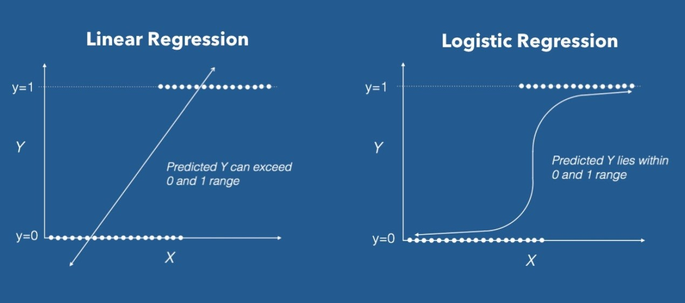
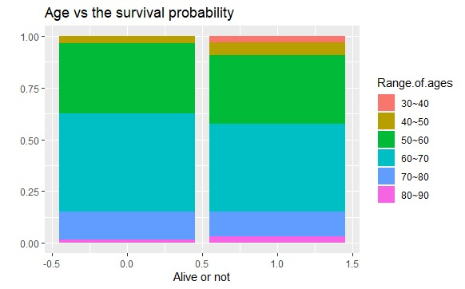
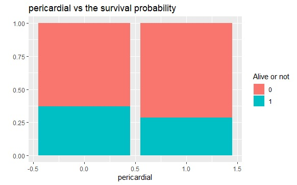
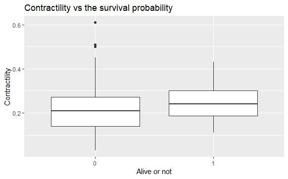
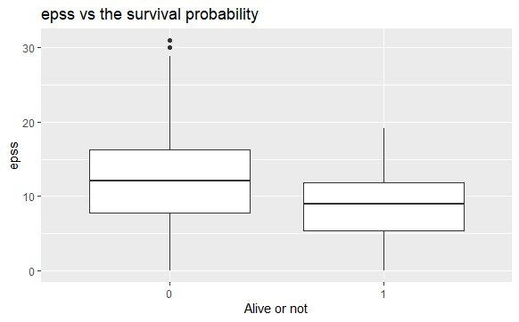
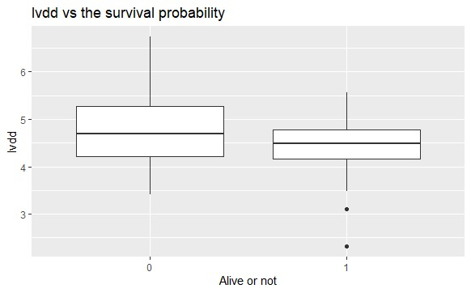

## Introduction
A heart attack represents a life changing event, and of course many people feel scared and confused after a heart attack. But wouldn’t it be better if you get a confirmed prediction of your survival? So, we’re planning to work on a Data set of patients to be able to predict whether a patient dies within a year or survives. 
There are few released articles concerning the same scope, one was published November 1, 1986 in Heart journal 

 It mainly was about a cross sectional echocardiographic study of 345 patients. And its result would be very helpful in our research.
## Why did we choose this particular matter?
No one can deny that heart disease is the number one health threat in the world as it’s responsible for the most deaths worldwide for all genders and races. According to the AHA - [American Heart Association](https://www.healthline.com/health/heart-disease/statistics) – every 40 seconds an American citizen will have a heart attack  . 

The estimated annual incidence of heart attacks in the USA is 720,000 new attacks and 335,000 recurrent attacks. Doing researches and building statistics in such field is so interesting cause you’re trying to minimize the danger of the number one health threat worldwide by predicting
the survival of patients and giving them hope in life after they’ve lost it. And also, by predicting the people who will not survive we’re giving them a chance to take good care of their health and by that they may beat the prediction and survive.

## What is Logistic regression?

In the past, to express our data by a graph we used a formula which named by linear regression, but by the time we found that there's a data which represented by only the values of (0,1) and if we use the linear regression with these data it will not give us the best representation of it.
So as we deal with the data of (0,1) for the best representation of it we use the logistic regression.
It is derived from the sigmoid function:  
$$p= \frac{1}{1+e^{-y}}$$    
$x^2$   
And the final logistic regression function is:  $$ln⁡(p/(1-p))=b_0+b_1 x$$  
  
By this function we can get the best fitting line that can fit these data and the line is the same slope of the line of linear regression
As we use this representation, we can use it to predict probabilities and we are very touched on the probabilities that lives between 0,1 and instead of predicting for sure that a something will or will not happen, we predict probability.

## Objective
To build a model to accurately predict whether the patient who had a heart attack will survive in one year or not.
To achieve this objective, we checked the performance of our model using three parameters, which are: 
*	Accuracy: the percentage of the people who were truly predicted whether they survived or not.
*	Sensitivity: the percentage of the people who were truly predicted to survive over the people who did actually survive. 
*	Specificity: the percentage of the people who were truly predicted to not survive over the people who didn’t actually survive.
We are deeply concerned about the specificity parameter because it would be a disaster if we predicted that some patient will survive and the actual result is that he won’t. So, we tried to make that parameter as accurate as possible through our work. 

## Dataset
We are mainly going to use Ecocardiogram data set from the [UCL machine learning repository](https://archive.ics.uci.edu/ml/datasets/echocardiogram).   This data set was donated by [Dr. Steven Salzberg](https://www.bme.jhu.edu/faculty_staff/steven-l-salzberg-phd/)  in February 28, 1989. He used it in a research that was concerned
in computing technology

The original dataset has 12 columns and 132 records. To make it easy for us to work on the data set we reduced the columns to 8 as we deduced that some of the features were concluded from other ones and some of them are useless in our work. Also, we faced some difficulties with the records as there were too many missing values, so -after we had a look on other resources that used this data set- we had to reduce the records to just 90. The deleted recorded were mainly deleted because of they had so many missing values or because the patient was observed for less than a year and we’re interested in whether the patient will survive or not in a year or more.

## Visualization
Before we began in building our model, we created some plots to help us
understand the features better like what feature really affect the factor of
survival that we wish to predict. We would like to show you some of these
plots to see the whole picture and understand the problem better. And we
will represent our visualizations in two types of plots:
* Segmented bar plot : it’s a chart that shows comparisons between
data categories using bars, but with an ability to compare parts of one
category. Each bar in the chart represents a category, and segments in
this bar represents different parts of the category.
* Box plot : it’s often used to describe a numerical data not the binary
ones. with a vertical line inside to indicate the median value of these
numerical data.
*And now, Shall we begin?*

### Age 
 The following figure represents the survival probability
depending on the relation between the variance of ages (Y-Axis) and if the
segment of that specific age in our dataset had survived or not (X-Axis).

   
 
* The column with (0.0) : illustrates the patients who had been passed
away.
* The column with (1.0): illustrates the patients who had been survived.
We notice that the younger patients in the range of ages between (30~40)
which represented by the first segment almost all of them had been
survived in the right column, and this segment almost disappeared in the
left column.
but we can notice either that the segment with the oldest patients in the
range of ages between (80-90) more of them had been survived ... and we
can explain that, because, simply, the Age is not the only factor that affects
our output. we have many other features can impact. and we will prove that
in the upcoming graphs.

### Pericardial Effusion
The following figure clarifies a binary-to-binary relationship
between our permanent parameter (Alive or not) and the pericardial
parameter.
  
The pericardial effusion is the excessing fluid between the heart and the sac
surrounding the heart. And we examine if the patient has a pericardial
effusion or not (zero or one).
It’s clear in the chart that the less patients have pericardial effusion, the
more survival probability they have, because the pericardial effusion is a
really serious threat to our patients’ lives.

### Contractility
The following figure describe the relevance between the numerical
values of the contractility and the survival probability.
  
Don’t feel shocked about the graph. we’ve made a deal together that the
discrete values are preferred to be represented by a box plot. And we’re only
considered with the horizontal line inside this rectangle. which symbolize
the median value.
You can pay attention here and say that it’s clear that the median of the
rectangle on the right is more elevated than the median of the left rectangle.
And, definitely you’re right, but what does it mean?
before I answer this question, I must answer another question, what is the
contractility?
Contractility is the ability of the muscle to contract, any muscle, so we can
state that it exemplifies the strength of the muscle. And the muscle that we
mean here is the heart muscle.
Now, I don’t need to answer your first question “what does this graph
mean?”. You can do it.
The patients who had a higher contractility ratio (higher median value), had
a higher chance to live (in the rectangle on the right).

### EPSS
this figure is just like the previous one but the relationship is different this time
  
It’s between the EPSS and the survival probability. The EPSS is the
acronym for E - P oint S eptal S eparation
When the left ventricle relaxes during diastole, blood rushes through the
mitral valve, swinging open the anterior mitral valve leaflet toward the
interventricular septum. In the early stages of diastolic filling, the anterior
mitral valve reaches a point of maximum excursion, and as such comes
closest to the ventricular septum (E-point). The distance in space
separating the anterior mitral valve leaflet from the septal wall is referred to
at the E-point septal separation.
in conclusion, it’s a factor represents the strength of the heart, but in
inversely proportional way. Where larger numbers are increasingly
abnormal.
So, the corresponding graph illustrates a greater median value of the EPSS
in the left column, which represents the patients who had been passed
away.
Which means the greater value of the EPSS factor, the lower probability of
this patient to live.

### LVDD
The last relationship between our features and our lasting
factor. It’s another story which is performed by the box plot because of the
numeral values. It’s a relation between the LVDD and the survival
probability. The LVDD is for L eft V entricular D iastolic D ysfunction. And
it’s defined as the inability of the ventricle to fill to a normal end-diastolic
volume.
Thus, from the definition, it’s obvious that if its value is high, so it’s a
serious threat. So, it’s not preferred for sure to find a great value of it in the
examination. It’s a bad sign.
  
And our graph corroborates these words. The median line,which is our only
concern, is higher in the column which represents the dead (The left
rectangle).

## Steps of building the model

1. At first, we imported the dataset as a csv file and assign three variables for accuracy, specificity and sensitivity
```
# Importing the dataset
dataset= read.csv('PreData.csv')

#accuracy, specificity and sensitivity variables
acc=0
sp=0
sen=0
```
2.	We used the cross-validation technique to train our model. This technique allows you to train your model multiple times by changing the training set and the test set each of these times. After you finished training you take the average of the accuracy, sensitivity and specificity. This is a very good technique to let you be aware of the performance of your model.We used 10-fold cross-validation, so we made a for loop that will repeat 10 times. After that we split the data set into a test set with 9 records and a training set with 81 records. 
```
#cross validation with 10 folds
for (i in c(0,9,18,27,36,45,54,63,72,81)) {
  
# Splitting the dataset into the Training set and Test set
  training_set = dataset[-((1+i):(9+i)),]
  test_set = dataset[((1+i):(9+i)),]
  
```
3.	As our features has different ranges, we had to scale them so that they have the same range of numbers. The features that needed to be scaled are from column 2 to 6 and the other features are yes/no features, so no scaling needed. That allowed the classifier to be generated successfully using the logistic regression algorithm. This classifier has learned a pattern about the training set that we will use later for the prediction in the test set. 
```
 # Feature Scaling
  training_set[,2:6] = scale(training_set[,2:6])
  test_set[,2:6] = scale(test_set[,2:6])
  
  # Fitting Logistic Regression to the Training set
  classifier = glm(formula = Alive.or.not ~ .,
                   family = binomial,
                   data = training_set)
  
```
4.	At this section, we made a prediction vector of the survival factor that we are interested in using the classifier we have made before. We used the test set in order to make this vector. The prob_pred is a prediction vector but has continuous variables. What we want is to convert these continuous variables into discrete levels -0 or 1- to indicate whether the patient will survive or not. That’s why we made the y_pred vector. 
After that, the confusion matrix was created between the predicted values and the actual ones from the test set.
```
# Predicting the Test set results
  prob_pred = predict(classifier, type = 'response', newdata = test_set[-7])
  y_pred = ifelse(prob_pred > 0.5, 1, 0)
  
  # Making the Confusion Matrix
  cm = table(test_set[, 7 ], y_pred)
  
```
5.	Finally, we calculate the accuracy, specificity and sensitivity using the confusion matrix. The final step is to take the average of the three parameters and this will be our final output.
```
#calculating the accuracy,specificity and sensitivity
  acc= acc + (cm[1,1]+cm[2,2])/sum(cm)
  sp= sp + cm[1,1]/(cm[1,1]+cm[1,2])
  sen= sen +  cm[2,2]/(cm[2,1]+cm[2,2])
  
}

acc= acc/10
sp= sp/10
sen= sen/10
```

### Output
Our output is not exactly the best and that is mainly because of two problems:
*	The records number is very low, so the model had not enough records to train on.
*	There were too many missing values and that -of course- affects the performance of our model.
But the important thing is that the specificity percentage is high enough to be considered good and that is the most important parameter in our problem.
```
> acc
[1] 0.6222222
> sp
[1] 0.8152381
>sen
[1] 0.3583333
```

##  Summary
At the end, we successfully obtained our goal and that is being able to predict whether the patient who suffered a heart attack will survive for one year or nor depends on some medical measurements. We faced some difficulties due to the small number of records and the missing values that led to reducing the model performance. Despite that, we obtained an acceptable specificity percentage and that is our most important parameter as we said before. So, the final result is fine with us but we are looking forward to enhance our model performance using advanced methods and that will be our future work.
